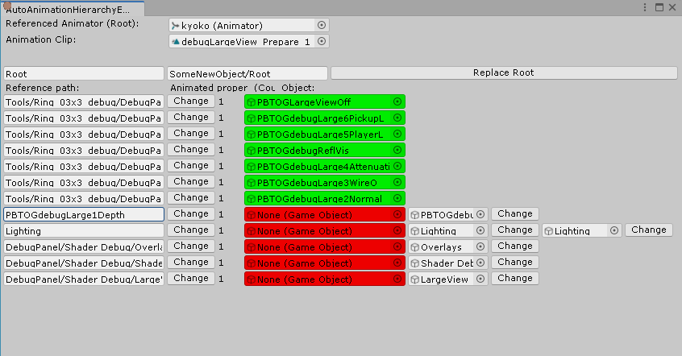

Unity Auto Animation Hierarchy Editor
================================

2025/02/07

Forked from "Animation Hierarchy Editor" by s-m-k.

- Change menu location to Tools > Auto Animation Hierarchy Editor.
- Provides suggestions for matching Gameobjects (to up 5).

----------------------

Unity Animation Hierarchy Editor
---

This utility will aid you in refactoring your Unity animations.

Place the AnimationHierarchyEditor.cs file in the `[project folder]/Editors/` folder to make it work. Then you'll be able to open the Animation Hierarchy Editor window by navigating to Window > Animation Hierarchy Editor.

The editor should appear once you've selected the animation clip you want to edit.
